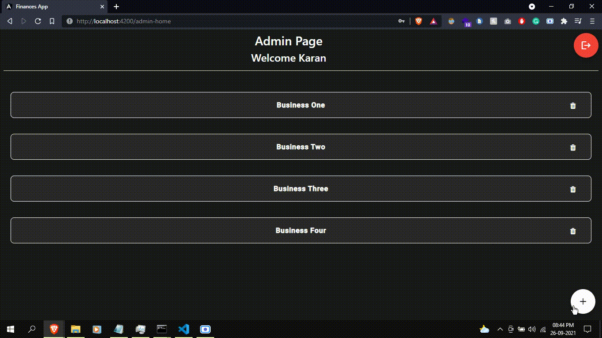
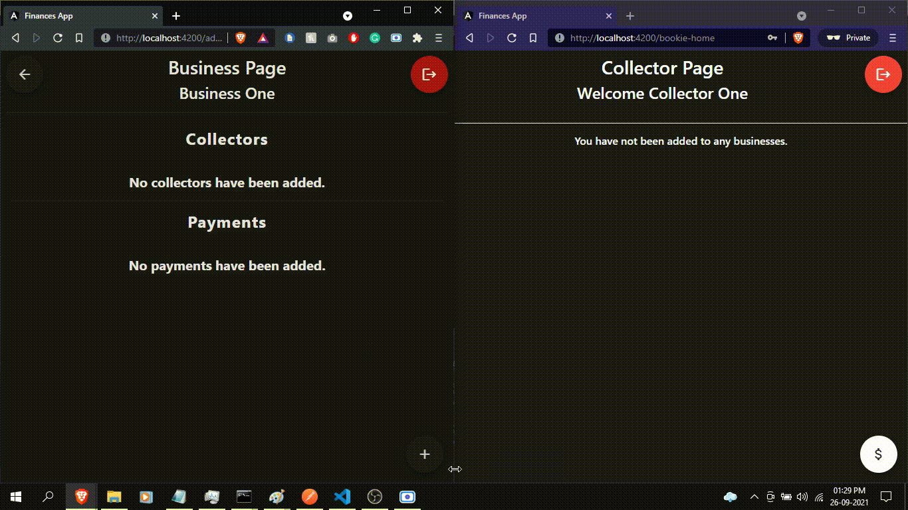
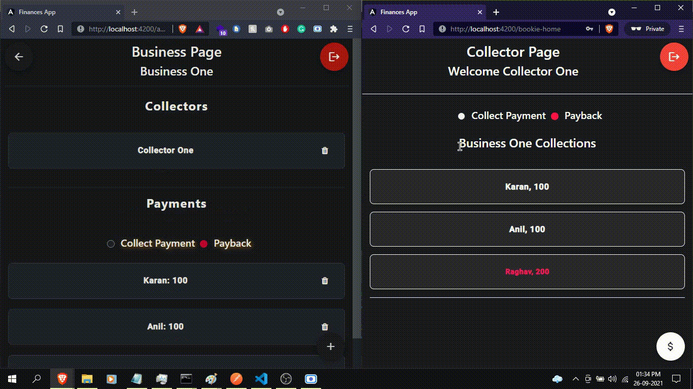

# Real-Time Payments Management System

A real-time system for managing payments of multiple businesses that need to be collected or given. The application has two types of accounts:

1. Business Owner/Admin
Can create multiple `Businesses` and register `Collector` accounts.
2. Collector
Responsible for completing the transaction and marking it as `Done`.

## Technologies

1. Frontend - Angular / HTML / SCSS / Material
2. Backend - Node JS, Express JS
3. Database - MongoDB
4. Web Sockets (Real-Time)

## Features

1. The business owner/admin can create businesses and collector accounts.

2. The business owner can create or delete `Payments`. These can either be payments to be collected or given. 
3. The business owner can assign collectors to particular businesses, who are responsible for collecting/giving the payments.

4. The collectors can view the payment information, like person name, contact, address details etc. And can mark the payment as `Completed`.
5. The business owners can mark the payment as `Approved`, indicating whether the transaction was completed by the collector.
6. The business owner can view the `Approved Payments` for a particular businesses that the collectors have made.
7. The collector can collect the amount in installments as well.



## Setup

### Local Setup
1. Clone the repository.
```
git clone 
```

2. Install NPM packages for both Node & Angular projects.
```
npm install
```

3. Make sure the Mongod service is running.

4. Start up the Node server, on the parent directory run:
```
nodemon
or
node app.js
```

5. Start up the Angular project, in the `angular-src` directory, run:
```
ng serve
```

6. The app will be start on `http://localhost:4200` and the backend will be running on `http://localhost:5000` by default.

### Create Admin Account
1. Send a request through Postman on `http://localhost:5000/users/register` with the following data:

```
{
  "username": "admin",
  "password": "123456",
  "confirmPass": "123456",
  "name": "Karan",
  "email": "karan@gmail.com",
  "mobile": "1234567890"
}
```

2. Open Mongo console and run the following commands

```
use finances-app
db.users.update({username: "admin"}, {$set: {admin: true}})
```

## Have Fun!
